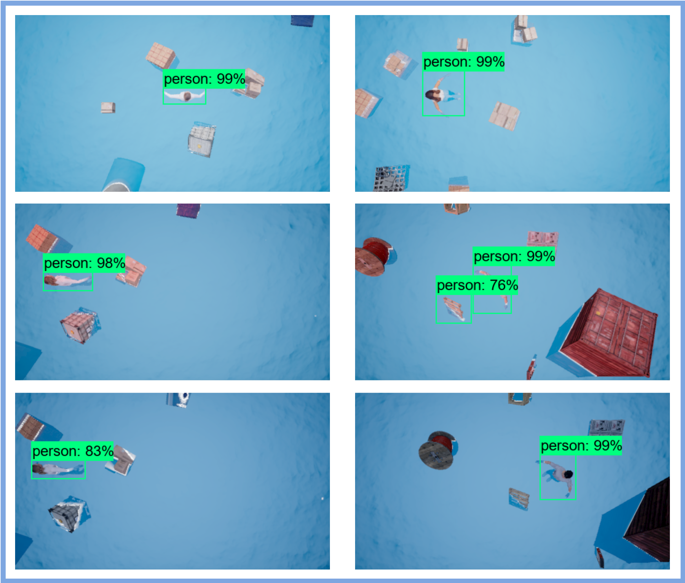

# Airsim: Search and Rescue SAR at sea with UAV integrated artificial intelligence

```
 python Get_dataset.py --radius 10 --altitude 8 --speed 2 --center "10,0" --iterations 1
```
<p align="center">
  
</p>
